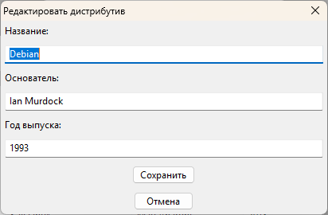

# DialogBlocks_SQLite_ext
Пример MVC-программы на C++ с использованием базы данных SQLite и wxWidgets в DialogBlocks

## Ссылки:

http://www.anthemion.co.uk/dialogblocks/

https://www.wxwidgets.org/

https://visualstudio.microsoft.com/ru/vs/community/

http://www.anthemion.co.uk/dialogblocks/ImageBlocks-1.07-Setup.exe
